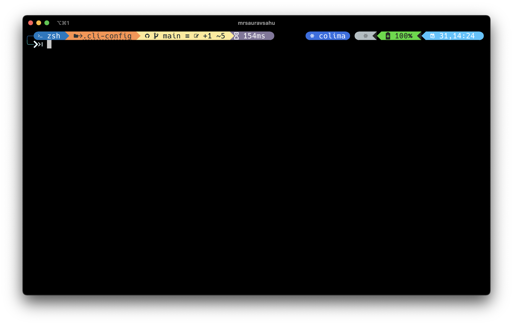
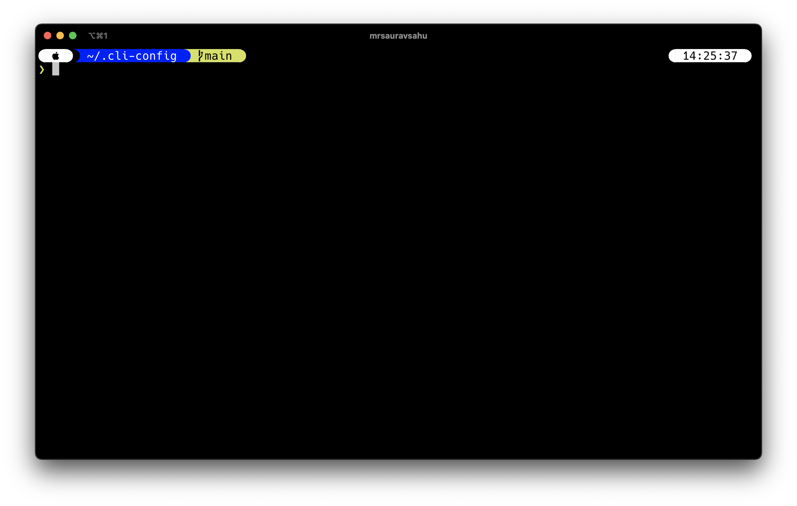

# details

## themes

cli-config uses [oh-my-posh](https://github.com/JanDeDobbeleer/oh-my-posh) themes. You can see all the available themes with -

```zsh
ls $CLI_CONFIG_ROOT/current/ohmyposh/themes
```

Few examples are - 

### atomic

### powerlevel10k_modern



You need to set the `$CLI_CONFIG_THEME` variable to change themes. Themes are set with the `oh-my-posh` command.

Once you change the variable, restart the terminal.
## Profiles 

cli-config has two profiles available out of the box. The [default](profiles/default) profile is automatically setup post installation.

### [mrsauravsahu](profiles/mrsauravsahu) profile

This is my specific customizations on top of cli-config. 

You can view the [.zshrc](./profiles/mrsauravsahu/.zshrc) file in this directory to see what commands I run.

To use this profile, simply symlink the `.zshrc` file in this directory to your home folder, which you can do with

```bash
# remove or move the current symlinked .zshrc
$ rm ~/.zshrc 
# depending on where your .cli-config folder is
$ ln -s ~/.cli-config/profiles/mrsauravsahu/.zshrc ~/.zshrc
```

## extras

There are more hidden gems in the [extras](extras) directory. This sets up extra packages that I frequently use. Checkout the [extras/setup.sh](extras/setup.sh) file for the details.

### modern UNIX alternatives

[ibraheemdev/modern-unix](https://github.com/ibraheemdev/modern-unix) is an awesome repository with a list of some cool alternatives to popular unix commands. I've added a few in [extras/modern-unix-brew-list.txt](extras/modern-unix-brew-list.txt) file. You can install them on macOS with:
```bash
cat extras/modern-unix-brew-list.txt | sed | xargs brew install
``` 
I'll try and add support for Linux soon along with an uninstall script :)

\- Saurav!

## updating cli-config

If you have already setup cli-config. It's also a good idea to keep things updated, or maybe you just want to get the latest goodies. This section will show you how to do that.

1. Branch

First of all, check if you're using on the `cool` or the `main` branch. Cli-config used to use `cool` as its default branch, but to maintain uniformity, moved to `main` branch. 

Make sure you back up any changes you made to the repo.

```bash
# Fetch latest changes
$ git fetch origin
# Switch to main branch
$ git checkout main
```

2. Cleanup & optional installs

You might not need all the things that cli-config installs. To see the list of tools available pass the `--help` switch.
You can pass the list of tools to install with the `-t` or `--tools` switch, like so
```bash
$ ./cli-config install --tools antigen,nvm,ohmyposh
```

3. Run the setup again

After thinking about it, I've decided that cli-config should retain the older installation even if you run `./cli-config` multiple times. So, incase you want to reinstall any tool, you can delete that folder or the entire `current` folder before running setup again. (Example: If you want to reinstall nvm, delete the `current/nvm` folder and run `cli-config` again)
