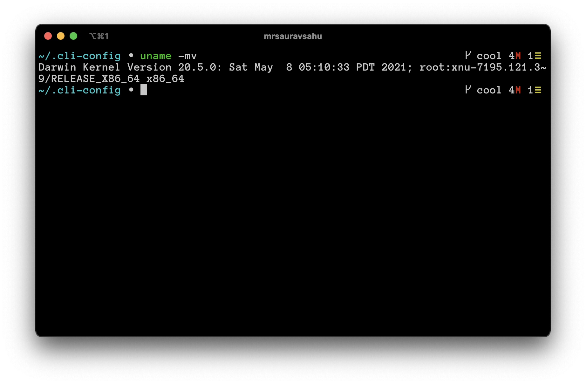
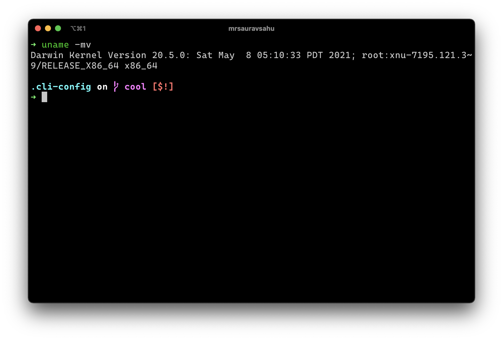

# cli-config

Helping you setup your CLI experience easily. Some goodies for the ol' terminal.

## What's new? 🎉
- Switch antigen themes with a single env variable `CLI_CONFIG_THEME`
- Extra tools available for Linux as well! Check out the [package list](extras/apt-list.txt).
- New extras package - [tmux](https://github.com/tmux/tmux/wiki)
- Setup apps and cool goodies on macOS with brew. Checkout the [extras](extras/setup.sh) script.
- Support for .nvmrc - set node version for a particular directory!

## Features
- one script setup
- works with Mac and Linux (Ubuntu)
- adds lots of helper tools to the shell
- easy theme switcher

---


## List of tools 

### Basics
- [ohmyzsh](https://github.com/ohmyzsh/ohmyzsh)
- [antigen](https://github.com/zsh-users/antigen)

### Programming Support
- [nvm (Node)](https://github.com/nvm-sh/nvm)
- [pyenv (Python)](https://github.com/pyenv/pyenv)
- [netcore (.NET Core)](https://github.com/dotnet/core) 

### Helpers and Goodies
- [direnv](https://github.com/direnv/direnv)
- [autojump](https://github.com/wting/autojump)
- [thefuck](https://github.com/nvbn/thefuck)

### Appearence
- [sindresorhus/pure (theme)](https://github.com/sindresorhus/pure)
- [zsh-syntax-highlighting](https://github.com/zsh-users/zsh-syntax-highlighting)
- [zsh-autosuggestions](https://github.com/zsh-users/zsh-autosuggestions)

## Getting Started

You require these:
- zsh
- curl
- wget
- git

Note: For installing packages,  you'll also require a package manager. On Linux, cli-config  uses `apt`. For macOS, `brew` should be installed, which you can download from [homebrew](https://brew.sh/)'s website.


To check if you have eveything installed

```zsh
which zsh curl wget git
```

should give you the path to all the four executables, like so:

```zsh
❯ which zsh curl wget git
/bin/zsh
/usr/local/bin/curl
/usr/local/bin/wget
/usr/bin/git
```

> CAUTION: Running the setup without these requirements will result in unknown consequences.

## Setup

### 1. Clone the repo (use ssh if you fancy)
```zsh
git clone http://github.com/mrsauravsahu/cli-config
```

### 2. Execute the setup script

> Before starting install, you can turn off some program installs if you don't use them. Programs installs turned off by default: .NET Core.
>
> Comment out programs you don't want to use in setup.sh 
```bash
...

echo "\n\nCLI-CONFIG: Installing programs\n\n"
. $CLI_CONFIG_ROOT/scripts/install.ohmyzsh.sh
. $CLI_CONFIG_ROOT/scripts/install.nvm.sh
. $CLI_CONFIG_ROOT/scripts/install.pyenv.sh
# . $CLI_CONFIG_ROOT/scripts/install.dotnet.sh

...
```

To start the setup, execute the setup.sh file.
```bash
./<path-to-setup.sh>
# example
~/Documents/code/personal/config/setup.sh
```

## Using cli-config

Once the setup is done, you can run the main script in your `.zshrc`
You can paste the instructions you get once you run the setup script.

Or add these lines to your `.zshrc`:

```bash
CLI_CONFIG_ROOT='<path-to-cli-config>'
source "$CLI_CONFIG_ROOT/main.sh"

# example
CLI_CONFIG_ROOT='/Users/sauravsahu/Documents/code/personal/config'
source "$CLI_CONFIG_ROOT/main.sh"
```

## Switching themes

You need to set the `$CLI_CONFIG_THEME` variable to change themes. Themes are set with the `antigen theme <$CLI_CONFIG_THEME>` command.

Once you change the variable, run an `antigen reset` and restart the terminal to see the changes.
## Using [mrsauravsahu](profiles/mrsauravsahu) profile

You can view the `main.sh` and `.zshrc` files in this directory to see what commands I run.

To use this profile, simply symlink the `.zshrc` file in this directory to your home folder, which you can do with

```bash
$ ln -s ~/.cli-config/profiles/mrsauravsahu/.zshrc ~/.zshrc
# depending on where your .cli-config folder is
```
## My Personal Terminal Profile

This repo contains my personalized terminal profile, in the [profiles/mrsauravsahu](./profiles/mrsauravsahu) directory to get a quick start if you'd like. 

Here are the themes I use on a regular basis, and switch among them when I feel like it.

- [mengelbrecht/slimline](https://github.com/mengelbrecht/slimline)



- [denysdovhan/spaceship-prompt](https://github.com/denysdovhan/spaceship-prompt)



## extras

There are more hidden gems in the [extras](extras) directory. This sets up extra packages that I frequently use. Checkout the [extras/setup.sh](extras/setup.sh) file for the details.

### modern unix alternatives

[ibraheemdev/modern-unix](https://github.com/ibraheemdev/modern-unix) is an awesome repository with a list of some cool alternatives to popular unix commands. I've added a few in [extras/modern-unix-brew-list.txt](extras/modern-unix-brew-list.txt) file. You can install them on macOS with:
```bash
cat extras/modern-unix-brew-list.txt | sed | xargs brew install
``` 
I'll try and add support for Linux soon along with an uninstall script :)

\- Saurav!