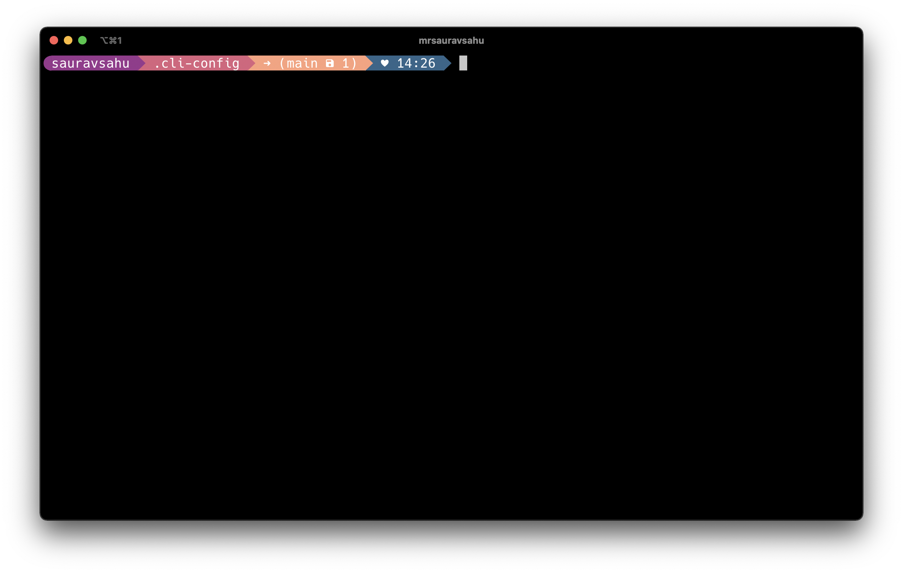

# cli-config
Helping you setup your CLI experience easily. Some goodies for the ol' terminal.


## Install

> Checkout [install.md](./install.md) for other methods of installation & more details.

Use the `init.sh` script to setup in a single step! You can visit the link - https://raw.githubusercontent.com/mrsauravsahu/cli-config/main/init.sh to see its raw contents, which is just a git clone followed by calling the `setup.sh` script.

```bash
wget -O- https://raw.githubusercontent.com/mrsauravsahu/cli-config/main/init.sh | bash -s -- -p default
```
This will create a folder called `cli-config` inside the current folder and installation will happen there.

Once the setup is done, your `~/.zshrc` will be symlinked to the [default profile](./profiles/default/.zshrc). You will be able to edit the `~/.zshrc` for any customizations.

## Features
- one script setup
- works with Mac and Linux (Ubuntu, Pop!_OS) & Windows (WSL)
- adds lots of helper tools to the shell
- easy theme switcher

---

## List of tools 

### Basics
- [ohmyzsh](https://github.com/ohmyzsh/ohmyzsh) for zsh plugins
- [oh-my-posh](https://github.com/JanDeDobbeleer/oh-my-posh) for prompt customization and theming
- [antigen](https://github.com/zsh-users/antigen) for more plugins 😉

### Programming Support
- [nvm](https://github.com/nvm-sh/nvm) for managing multiple node versions
- [pyenv](https://github.com/pyenv/pyenv) for multiple python versions
- [dotnet](https://github.com/dotnet/core) 
- [tfenv](https://github.com/tfutils/tfenv) manage multiple terraform versions

### Helpers and Goodies
- [direnv](https://github.com/direnv/direnv)
- [autojump](https://github.com/wting/autojump)
- [thefuck](https://github.com/nvbn/thefuck)

### Appearence
- [M365Princess theme from oh-my-posh](https://github.com/JanDeDobbeleer/oh-my-posh/blob/main/themes/M365Princess.omp.json)
- [zsh-syntax-highlighting](https://github.com/zsh-users/zsh-syntax-highlighting)
- [zsh-autosuggestions](https://github.com/zsh-users/zsh-autosuggestions)

## What's new? 🎉
- Manage multiple terraform version with [tfenv](https://github.com/tfutils/tfenv).
- Theming & Prompt customization support with [oh-my-posh](https://github.com/JanDeDobbeleer/oh-my-posh).
- Fresh new installation experience, powered by [Bash oo Framework](https://github.com/niieani/bash-oo-framework).
- Switch antigen themes with a single env variable `CLI_CONFIG_THEME`
- Extra tools available for Linux as well! Check out the [package list](extras/apt-list.txt).
- New extras package - [tmux](https://github.com/tmux/tmux/wiki)
- Setup apps and cool goodies on macOS with brew. Checkout the [extras](extras/setup.sh) script.
- Support for .nvmrc - set node version for a particular directory!

\-S
